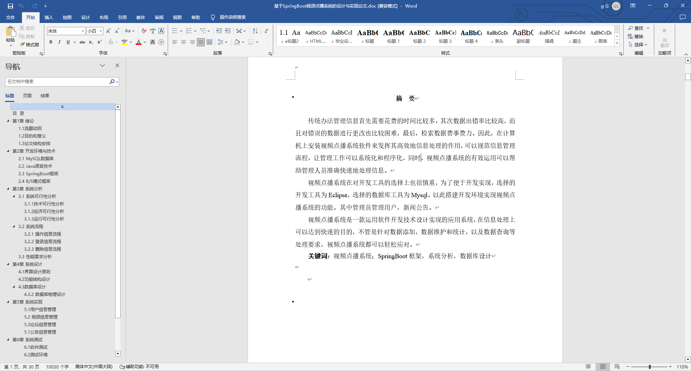
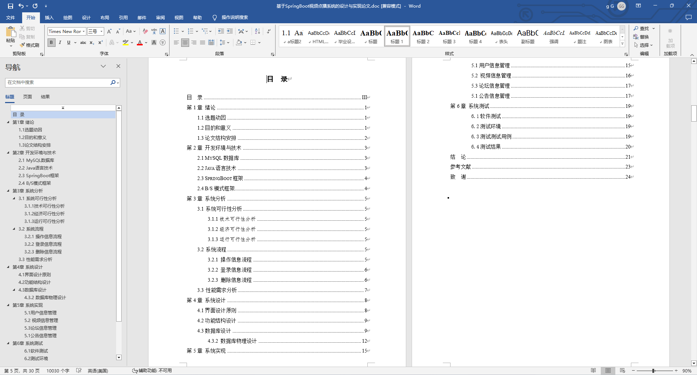
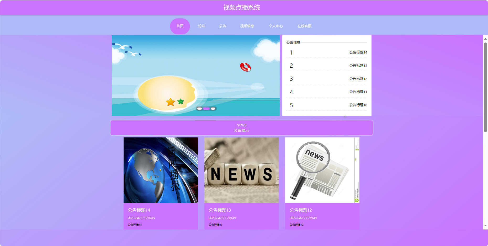
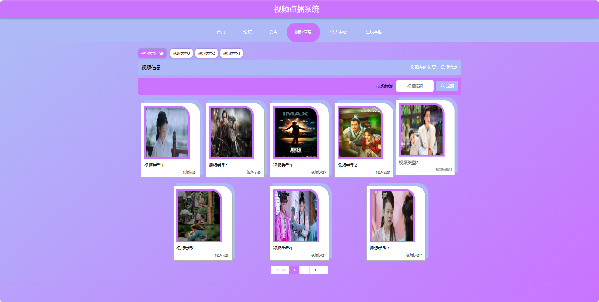
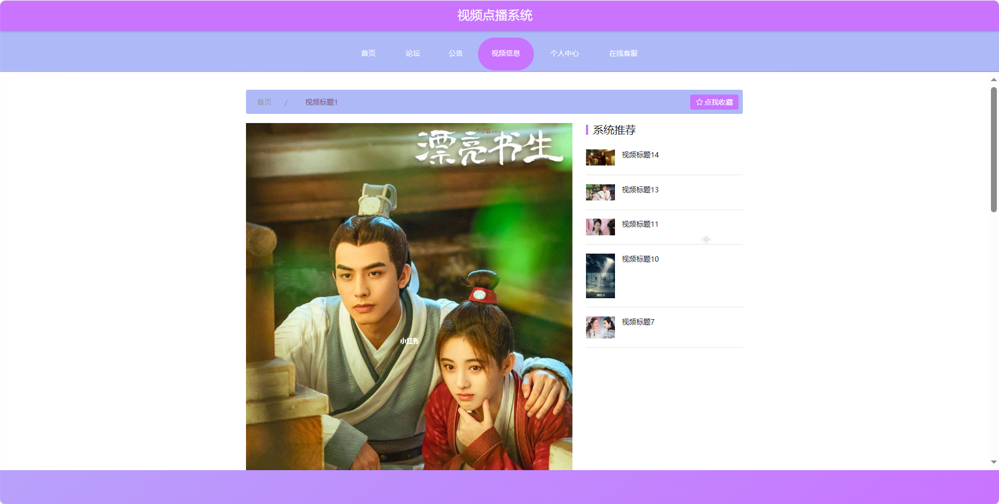
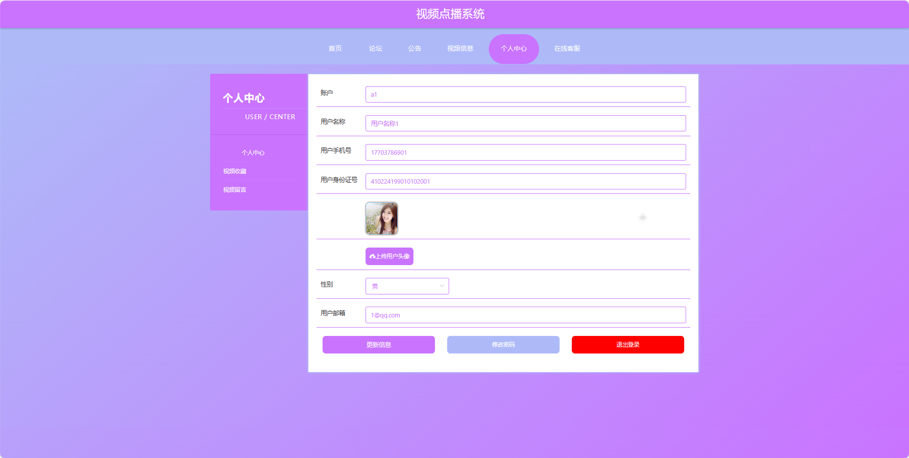

基于Springboot的视频点播系统（程序+论文）
=
### 完整代码获取地址：从戎源码网 ([https://armycodes.com/](https://armycodes.com/))
### 作者微信：19941326836  QQ：952045282 
### 承接计算机毕业设计、Java毕业设计、Python毕业设计、深度学习、机器学习
### 选题+开题报告+任务书+程序定制+安装调试+论文+答辩ppt 一条龙服务
### 所有选题地址https://github.com/nature924/allProject

一、项目介绍
---
基于Spring Boot框架实现的视频点播系统，系统包含两种角色：管理员、用户主要功能如下。

### 【用户功能】
1. 首页：浏览系统。
2. 论坛：参与视频讨论、提问和分享观点。
3. 公告：获取系统发布的重要公告和通知。
4. 视频信息：查看视频列表、详情和相关信息。
5. 个人中心：管理个人信息、查看观看历史和收藏的视频。
6. 在线客服：与客服人员进行实时在线沟通。

### 【管理员功能】
1. 首页：查看系统整体情况。
2. 个人中心：管理管理员的个人信息。
3. 管理员管理：维护系统管理员的账户信息。
4. 客服聊天管理：查看和处理用户的在线聊天记录。
5. 基础数据管理：管理系统的基础数据，如视频分类等。
6. 论坛管理：管理视频讨论论坛，审核和回复帖子。
7. 公告管理：发布、编辑和管理系统的公告信息。
8. 视频信息管理：添加、编辑和删除视频信息。
9. 用户管理：查看和管理系统的用户信息。
10. 轮播图信息：管理系统首页的轮播图展示。

二、项目技术
---
- 编程语言：Java
- 数据库：MySQL
- 项目管理工具：Maven
- 前端技术：VUE、HTML、Jquery、Bootstrap
- 后端技术：Spring、SpringMVC、MyBatis

三、运行环境
---
- 操作系统：Windows、macOS都可以
- JDK版本：JDK1.8以上都可以
- 开发工具：IDEA、Ecplise、Myecplise都可以
- 数据库: MySQL5.7以上都可以
- Tomcat：任意版本都可以
- Maven：任意版本都可以

四、运行截图
---
### 论文截图：

### 程序截图：

